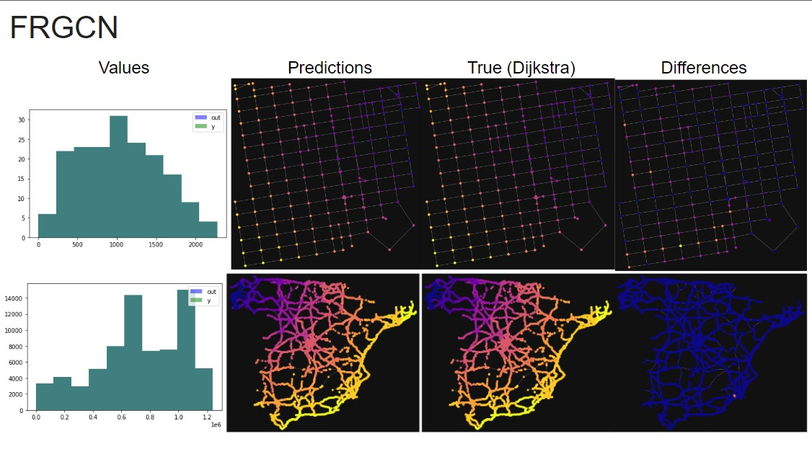
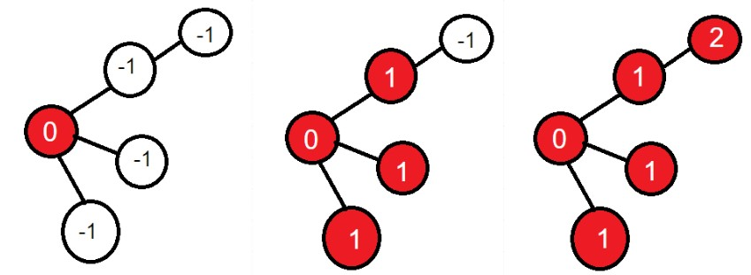
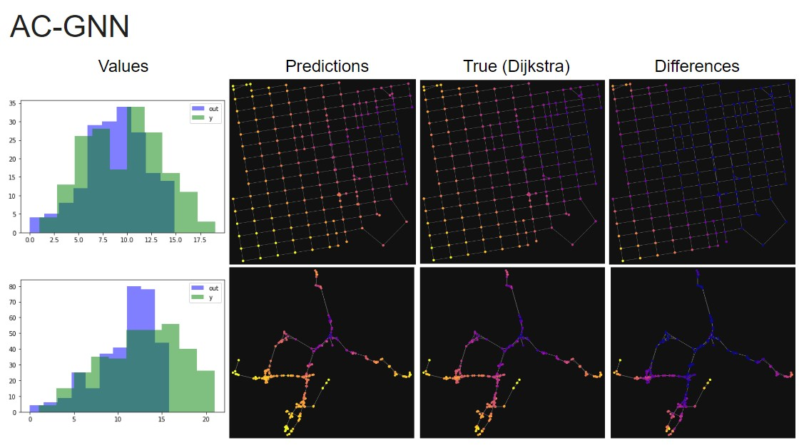

# Heuristics-GNNs

Two Graph Neural Networks that learns (via supervised learning) to label graph nodes with an heuristic value given their neighbors, and the resulting graph can be used combined with a search algorithm to find the best path/moves/node-sequence. Tested in the shortest path routing problem with edge weights.

Data and examples can be found in their respective folder. You can create a conda environment with ```requirements.txt```.

Made with pytorch and pytorch-geometric.

## Models

### Forward Recurrent Graph Convolutional Networks (FRGCN)



A recursive graph neural network that iteratively propagates values from starting nodes to the rest of the graph, until a specified number of passes are done or until all nodes in the graph are modified.

Makes use of a ```TurnOff``` layer, which works similarly to dropout, and nodes that don't pass a given criteria are turned off in the next inner iteration, keeping their values for the rest of the forward pass. The following image shows an example for a criteria ```x > 0``` in three iterations:



The example model contains 1-layered graph convolutional + turnoff operator (without normalization), which is capable of propagate values at distance 1 each iteration. More convolutional layers should increase expressiveness and propagate to further distances, but learning can become more difficult.

Results show that the model can learn graph heuristics like shortest distance with and without edge weights, but the initial node value, aggregation method and propagation criteria must be carefully chosen. In this case, 0 for starting nodes, inf for unknown nodes, min aggregation and ```x < inf``` can be used to solve the problem.

### Recursive AC-GNN (RAC-GNN)



A recursive modified neural network based on the AC-GNN architecture from [Pablo Barceló, 2020](https://hal.archives-ouvertes.fr/hal-03356968/document)

Similarly to FRGCN, in each forward pass RAC-GNN performs a number of iterations with a Message Passing Network architecture over the graph, modifying **all** nodes. It can be seen as a neural networks that learns a one-step operation to update the heuristic value of a node given their neighbors.

Node initialization, aggregation operator and the number of inner iterations must be carefully chosen. The number of multilayer perceptrons can be freely modified.

Results show that it can learn to set the correct value for values seen in the dataset, but suffers from generalization with values out of the dataset. Nevertheless, it still is capable of keep correct heuristic order.

## Citation

If you would like to cite this planner in an scientific publication, please use the following command:

```bibtex
@unpublished{vellidoGNN,
  title={Heuristics Graph Neural Networks},
  author={Ignacio Vellido and Carlos N{\'u}{\~n}ez-Molina},
  note={https://github.com/IgnacioVellido/Heuristics-GNNs},
  year={2022}
}
```
